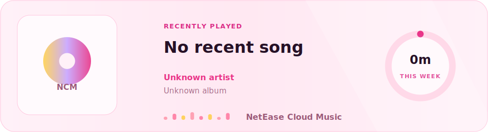
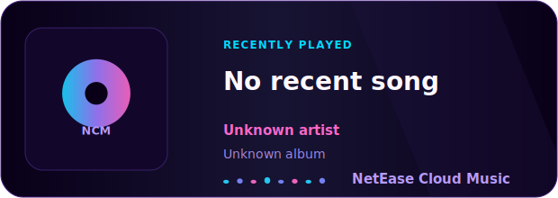

# NetEase Cloud Music Profile

在 GitHub 个人主页展示网易云最近播放。

## 最近在听

<picture>
  <source media="(prefers-color-scheme: dark)" srcset="./cards/netease-dark-large.svg">
  <source media="(prefers-color-scheme: light)" srcset="./cards/netease-light-large.svg">
  
</picture>

## 使用

1. Fork 这个仓库。
2. 如果要直接显示在个人主页，把仓库名改成你的 GitHub 用户名。
3. 本地运行 `npm install`。
4. 本地运行 `npm run login`，用网易云音乐 App 扫码。
5. 本地运行 `npm run recent`，确认能获取最近播放。
6. 把 `.env.local` 里的 `NETEASE_COOKIE` 添加到 GitHub Actions Secret。
7. 在仓库 Actions 页面手动运行 `Update NetEase Cloud Music`，之后会每 30 分钟自动更新 SVG 卡片。

Secrets 支持两种写法：

- `NETEASE_COOKIE`：推荐，扫码登录生成的完整 cookie。
- `MUSIC_U`：只填 `MUSIC_U` 的值，简单但稳定性略低。

`.env.local` 是本地凭证文件，已经在 `.gitignore` 中忽略。

## 主题和尺寸

构建时会扫描 `themes/` 文件夹。每个主题是一个单独的 `.js` 文件，有几个主题文件就会生成几套卡片。

当前包含两套主题：

- `dark`：暗黑霓虹风格
- `light`：明亮樱花风格

每套主题会生成三种尺寸：

- `small`：`320x460`，上方封面，下方歌曲信息
- `medium`：`620x220`，左侧封面，右侧歌曲信息
- `large`：`960x260`，左侧封面，中间歌曲信息，右侧一周播放时长环形占比

生成文件示例：

```text
cards/netease-dark-small.svg
cards/netease-dark-medium.svg
cards/netease-dark-large.svg
cards/netease-light-small.svg
cards/netease-light-medium.svg
cards/netease-light-large.svg
```

也可以手动选择某个尺寸嵌入：

```md

```
